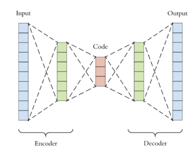

## AutoRec(Auto-encoders Meet Collaborative Filters)

### 개요

- [AutoRec: Autoencoders Meet Collaborative Filtering](http://users.cecs.anu.edu.au/~u5098633/papers/www15.pdf) (2015, Suvash Sedhain)
- 비지도 학습에서 대표적인 auto-encoder 방식을 협업 필터링에 접목했다는 점에서 의의가 있다.
- 논문 내용에서도 이것은 새로운 패러다임이고, 딥러닝 네트워크이 성공하면서 추천시스템에 적용하는 것에 저자가 흥미가 있었다고 한다.
- 논문 주장에 따르면 그 당시 state-of-the-art보다 우수하다는 것을 보여주고 있음.

 

### 참고. Auto Encoder란?

논문에 내용에 앞서서 Auto-Encoder에 대한 사전 학습이 선행되어야 하기 때문에 정리하고 넘어간다.

- Auto-Encoder는 동일 입축력 구조를 사용한다. 대표적인 비지도 학습 방법에 해당한다.
- 크게 2개 부분으로 나눌 수 있는데, Encoder, Decoder 이다
  - Encoder : 저차원(latent space)으로의 임베딩에 해당한다. 따라서 입력 데이터에서 가장 중요한 특성(feature)를 학습하도록 만든다.
  - Decoder : generative model로 사용할 수 있다.
- 입력값 Input(x)과 Auto-Encoder를 통해 나온 결과 y의 차이를 최소화하도록 학습을 하게 된다.
- 사실 비선형 함수를 사용하지 않고 선형(linear) 함수로 사용하고 손실함수를 MSE로 사용한 경우 PCA와 동일하다고 한다.

 
 

## The Autorec Model

### 소개

- 앞서 살펴봤던 MF도 Latent Factor를 사용하고 있고, 이번에 살펴보는 AutoRec 또한 Auto Encoder를 사용하여 유저 또는 아이템 벡터를 저차원의 Latent feature로 표현하는 것이다.
- 그리고 partially observed User-Item rating matrix R에 대한 Matrix Completion을 수행한다.
- 일반적인 Latent Factor 모델과 달리, AutoRec은 아이템, 유저 중 하나에 대한 임베딩만 진행한다.
  - 아이템을 임베딩하는 Item-based 구조는 I-AutoRec
  - 유저를 임베딩하는 user-based 구조는 U-AutoRec
- 여기서는 아이템을 임베딩하는 I-AutoRec을 기준으로 설명하도록 하겠다. 실제 성능 테스트 결과도 I-AutoRec이 더 좋게 나온다.

 

### Model architecture
